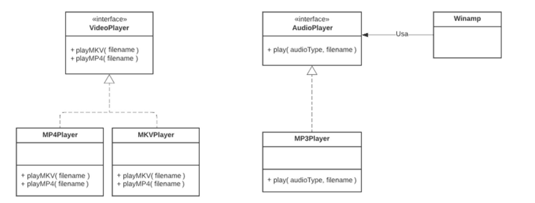

Uma empresa de software mantém no mercado sua solução de API de reprodução de áudio apenas com arquivos no formato mp3. Há também outros produtos voltados ao segmento de reprodução de arquivos de vídeo no formato mp4 e mkv. Porém, cada API só reproduz o formato de vídeo específico ao qual foi designado.

De acordo com a Figura 1, a interface VideoPlayer declara os métodos abstratos playMkv() e playMP4() e as respectivas classes realizadoras MKVPlayer e MP4Player implementam suas versões para os métodos. A interface **AudioPlayer** define os métodos que devem ser implementados pelas classes afins, no caso **MP3Player**. A classe cliente (Winamp),consome o serviço provido pela interface **AudioPlayer**. O código da solução atual acompanha esta atividade.

_**Figura 1:** Diagrama de classes da API._
## II. Tarefa
A empresa já dispõe de suas soluções para reprodução de arquivos de áudio e vídeo. Entretanto, terá de investir no momento para que o saudoso Winamp seja capaz de reproduzir o áudio de arquivos no formato MP4 e MKV. À luz do padrão Adapter faça o que se pede:
### 1. Examine o código atual. Há alguma crítica em relação ao design ilustrado na Figura 1 após analisar o código? Justifique sua resposta. 

**R:** Sim. É possível observar muitos problemas no digaram apressentado.

1. **Restringimento dos tipos suportados pelos Video Player**: Cada player de vídeo está fortemente acoplado ao formato específico que ele suporta.
     
2. **Falta de Flexibilidade:** O diagrama atual não suportaria a adição de um novo tipo de vídeo. Por exemplo, e se fosse preciso adicionar um videoPlayer capaz de reproduzir audios  _**FLAC**_? 

### 2. Introduza o padrão Adapter para permitir que o Winamp possa reproduzir o áudio de arquivos MP4 e MKV, além do já suportado formato mp3.

_código implementado_
